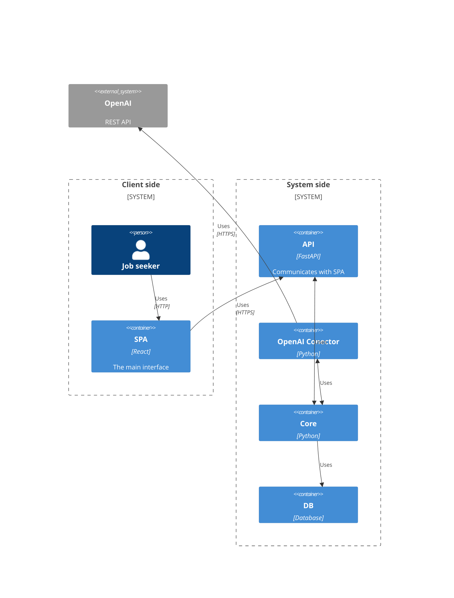

# Context diagram of the system

Main blocks:
- Client front-end
- API
- Business logic 
- OpenAI connector

Simple approximation, no queues yet

```mermaid
C4Context
    System_Boundary(client, "Client side") {
      Person(job_seeker, "Job seeker")
      Container(spa, SPA, "React", "The main interface")
    }

    System_Boundary(system, "System side") {
      Container(api, API, "FastAPI", "Communicates with SPA")
      Container(ai_con, OpenAI Conector, "Python")
      Container(core, Core, "Python")
      Container(db, DB, "Database")
    }


    System_Ext(openai, "OpenAI", "REST API")
    Rel(job_seeker, spa, "Uses", "HTTP")
    Rel(spa, api, "Uses", "HTTPS")
    Rel(ai_con, openai, "Uses", "HTTPS")
    BiRel(api, core, "Uses")
    BiRel(ai_con, core, "Uses")
    Rel(core, db, "Uses")

    UpdateLayoutConfig($c4ShapeInRow="1", $c4BoundaryInRow="2")

```